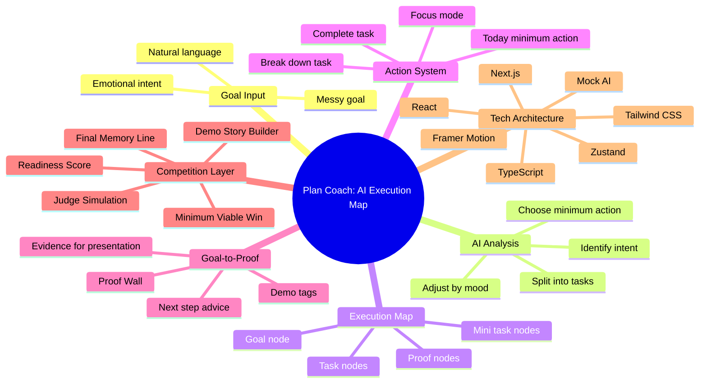
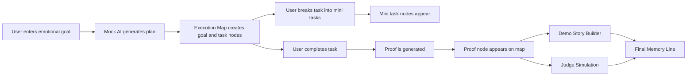

# Project Mind Map

This document describes the product logic as a mind map. It can be copied into any Markdown renderer that supports Mermaid.

## Execution Flow

## Why This Matters

The mind map is not only decoration. It explains the core product argument:

> Plan Coach does not manage tasks. It manages the transformation from goal to visible progress.
